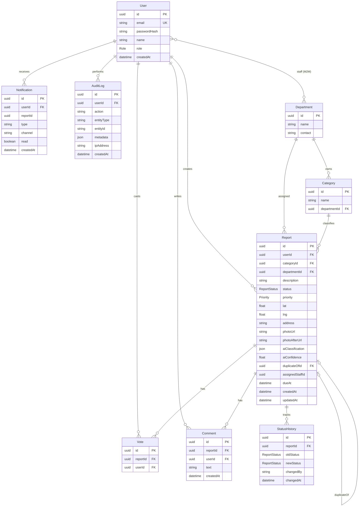

# Prizren Smart City — Architecture (Phase 0)

Dokumentacion arkitekturor përpara implementimit. **Nuk përmban kod aplikacioni.**

**Stack i vendosur:** Next.js 14 (App Router, TypeScript) · NestJS (TypeScript) · PostgreSQL/PostGIS · Prisma · Docker · Mapbox · Claude API (vision) · Cloudinary · Redis (cache/queue, Phase 2+)

---

## 1. Përmbledhje sistemi

Platformë qytetare për raportimin e problemeve urbane në Prizren. Qytetarët dërgojnë raporte me foto dhe lokacion; AI klasifikon; departamentet menaxhojnë workflow-in deri në zgjidhje. Faqja publike tregon hartë transparente **pa të dhëna personale**.

```
┌─────────────┐     ┌─────────────┐     ┌──────────────────┐
│  apps/web   │────▶│  apps/api   │────▶│  PostgreSQL      │
│  Next.js    │     │  NestJS     │     │  + PostGIS       │
└─────────────┘     └──────┬──────┘     └──────────────────┘
                           │
              ┌────────────┼────────────┐
              ▼            ▼            ▼
         Cloudinary    Claude API     Redis
         (foto)        (vision)    (Phase 2+)
```

**Monorepo (Phase 1+):** `apps/web`, `apps/api`, `packages/shared-types`

---

## 2. ERD — Skema e bazës së të dhënave

Bazuar në Prisma schema të Phase 1. `lat`/`lng` mjaftojnë fillimisht; kolonë PostGIS `geography(Point, 4326)` shtohet në Phase 4 për radius/clustering queries.



### Enums

| Enum | Vlera |
|------|--------|
| `Role` | `CITIZEN`, `DEPARTMENT_STAFF`, `DEPARTMENT_ADMIN`, `SUPER_ADMIN` |
| `ReportStatus` | `PENDING`, `IN_REVIEW`, `ASSIGNED`, `IN_PROGRESS`, `RESOLVED`, `REJECTED` |
| `Priority` | `LOW`, `MEDIUM`, `HIGH`, `CRITICAL` |

### Shënime skeme

| Çështje | Vendim |
|---------|--------|
| Staff ↔ Department | Many-to-many (join table `DepartmentStaff` ose relation Prisma `@relation("DepartmentStaff")`) — detajizohet në migrim Phase 1 |
| `Vote` unikitet | `@@unique([reportId, userId])` |
| `aiClassification` | JSONB: `{ category, severity, confidence, summary, recommendedDepartment }` |
| PostGIS | Kolonë `location geography(Point,4326)` + `ST_DWithin` në Phase 4 |
| `dueAt` | SLA automatik sipas priority (Phase 7) |

---

## 3. Role & permission matrix

| Veprim | citizen | department_staff | department_admin | super_admin |
|--------|:-------:|:----------------:|:----------------:|:-----------:|
| Regjistrohu / login | ✓ | ✓ | ✓ | ✓ |
| Krijo raport | ✓ | ✓ | ✓ | ✓ |
| Shiko hartën publike / listën (pa PII) | ✓ (dhe anonim) | ✓ | ✓ | ✓ |
| Shiko raportet e veta | ✓ | ✓ | ✓ | ✓ |
| Shiko të gjitha raportet (admin views) | ✗ | ✓ (vetëm dept. i tyre) | ✓ (vetëm dept. i tyre) | ✓ |
| Ndrysho status raporti | ✗ | ✓ (të caktuarat) | ✓ (dept.) | ✓ |
| Cakto departament / staf | ✗ | ✗ | ✓ (dept.) | ✓ |
| Accept / Edit AI classification | ✗ | ✗ | ✓ (dept.) | ✓ |
| Menaxho kategori | ✗ | ✗ | ✓ (dept.) | ✓ |
| Menaxho departamente / user roles | ✗ | ✗ | ✗ | ✓ |
| Analytics dashboard | ✗ | ✓ (dept., read) | ✓ (dept.) | ✓ (global) |
| Vote / comment (Phase 8) | ✓ | ✓ | ✓ | ✓ |
| Shiko audit logs | ✗ | ✗ | ✗ | ✓ |
| Upload before/after photo (Phase 7) | ✗ | ✓ | ✓ | ✓ |

**Rregulla të përgjithshme**

- Faqja publike **nuk** ekspozon `userId`, email, emër qytetari, apo `ipAddress`.
- `department_staff` vepron vetëm mbi raporte të caktuara atyre ose departamentit të tyre.
- `department_admin` ka scope brenda departamentit/të tyre.
- `super_admin` ka akses të plotë cross-department.

---

## 4. Security model

### 4.1 Autentikim

| Token | Jetëgjatësia | Ruajtja | Transport |
|-------|--------------|---------|-----------|
| Access JWT | **15 minuta** | Memory (frontend) — **jo** `localStorage` | `Authorization: Bearer <token>` |
| Refresh token | **7 ditë** | **httpOnly**, `Secure`, `SameSite=Strict` cookie | Cookie automatike në `/auth/refresh` & `/auth/logout` |

**Password hashing:** bcrypt ose argon2 (vendoset në Phase 2).

**Flow tipik**

1. `POST /auth/login` → access token në body + Set-Cookie refresh
2. Client mban access në memory; para skadimit → `POST /auth/refresh`
3. `POST /auth/logout` → invalidon refresh / pastron cookie
4. Guards: `JwtAuthGuard` + `RolesGuard` + `@Roles(...)`

### 4.2 Rate limiting (Phase 9, planifikuar që tani)

| Endpoint / veprim | Limit (propozuar) |
|-------------------|-------------------|
| `POST /auth/login`, `POST /auth/register` | 5 / min / IP |
| `POST /reports` | 10 / orë / user (ose IP për guest nëse lejohet) |
| `POST /reports/:id/votes` | 30 / min / user |
| Global API | 100 / min / IP (baseline `@nestjs/throttler`) |

### 4.3 File upload constraints

| Constraint | Vlera |
|------------|--------|
| MIME types të lejuara | `image/jpeg`, `image/png`, `image/webp` |
| Madhësia max | **5 MB** (fillim; rishikohet sipas nevojës) |
| Validim | Extension + Content-Type; Phase 9: magic bytes |
| Upload path | **Signed upload nga backend** → Cloudinary (API key **nuk** shkon në frontend) |
| CAPTCHA / honeypot | Phase 9 në forma publike |

### 4.4 Të tjera

- HTTPS në prodhim; cookie `Secure`.
- CORS whitelist për origin të frontend-it.
- AuditLog për veprime admin (status change, assignment, role changes).
- Secrets vetëm në env / secret manager — asnjë kredencial në repo.

---

## 5. API specification

Base path: `/api/v1` (ose prefix Nest global). Auth: `Auth` = JWT access kërkohet; `Public` = pa login; `Roles` = role të lejuara.

### 5.1 Health

| Method | Route | Auth | Përshkrim |
|--------|-------|------|-----------|
| `GET` | `/health` | Public | Liveness; kthen `{ status: "ok" }` |

### 5.2 Auth

| Method | Route | Auth | Request | Response |
|--------|-------|------|---------|----------|
| `POST` | `/auth/register` | Public | `{ email, password, name }` | `{ user: PublicUser, accessToken }` + Set-Cookie refresh |
| `POST` | `/auth/login` | Public | `{ email, password }` | `{ user: PublicUser, accessToken }` + Set-Cookie refresh |
| `POST` | `/auth/refresh` | Cookie refresh | — | `{ accessToken }` |
| `POST` | `/auth/logout` | Auth (+ cookie) | — | `204` / `{ ok: true }` |

### 5.3 Users

| Method | Route | Auth | Request / Query | Response |
|--------|-------|------|-----------------|----------|
| `GET` | `/users/me` | Auth | — | `PublicUser` |
| `PATCH` | `/users/me` | Auth | `{ name? }` | `PublicUser` |
| `GET` | `/users` | Auth · `SUPER_ADMIN` | `?role&page&limit` | paginated users |
| `PATCH` | `/users/:id/role` | Auth · `SUPER_ADMIN` | `{ role, departmentIds? }` | `PublicUser` |

**`PublicUser`:** `{ id, email, name, role, createdAt }` — pa `passwordHash`.

### 5.4 Reports

| Method | Route | Auth | Request / Query | Response |
|--------|-------|------|-----------------|----------|
| `POST` | `/reports` | Auth · citizen+ | `multipart`: `photo`, `description`, `lat`, `lng`, `address?`, `categoryId?` | `Report` (status `PENDING`) |
| `GET` | `/reports` | Public* | `?status&categoryId&departmentId&bbox&page&limit&from&to` | paginated **sanitized** reports |
| `GET` | `/reports/nearby` | Public* | `?lat&lng&radiusKm` | reports brenda radiusit (PostGIS Phase 4) |
| `GET` | `/reports/:id` | Public* | — | report detail (sanitized nëse public) |
| `GET` | `/reports/mine` | Auth | `?page&limit` | raportet e userit aktual |
| `PATCH` | `/reports/:id/status` | Auth · staff/admin | `{ status, note? }` | `Report` + shkruan `StatusHistory` + `AuditLog` |
| `PATCH` | `/reports/:id/assign` | Auth · dept_admin+ | `{ departmentId?, assignedStaffId? }` | `Report` |
| `PATCH` | `/reports/:id/ai-classification` | Auth · dept_admin+ | `{ action: "accept" \| "edit", classification? }` | `Report` |
| `POST` | `/reports/:id/photo-after` | Auth · staff+ | `multipart` photo | `Report` (Phase 7) |

\* `GET` publike kthen **ReportPublic**: pa `userId`/email/emër; fusha të brendshme admin (audit) fshihen.

**`Report` (auth / owner / staff):**

```ts
{
  id: string
  userId?: string          // omitted in public
  categoryId: string | null
  departmentId: string | null
  description: string
  status: ReportStatus
  priority: Priority | null
  lat: number
  lng: number
  address: string | null
  photoUrl: string | null
  photoAfterUrl: string | null
  aiClassification: AIClassification | null
  aiConfidence: number | null
  duplicateOfId: string | null
  assignedStaffId: string | null
  dueAt: string | null     // ISO
  createdAt: string
  updatedAt: string
  voteCount?: number
}
```

**`AIClassification`:**

```ts
{
  category: 'road_damage' | 'lighting' | 'waste' | 'water' | 'public_space' | 'other'
  severity: 'low' | 'medium' | 'high' | 'critical'
  confidence: number       // 0..1
  summary: string          // max 300
  recommendedDepartment: string
}
```

**`bbox` query:** `minLng,minLat,maxLng,maxLat` (string e ndarë me presje) ose katër query params ekuivalente.

### 5.5 Votes & comments (Phase 8)

| Method | Route | Auth | Request | Response |
|--------|-------|------|---------|----------|
| `POST` | `/reports/:id/votes` | Auth | — | `{ voteCount }` (unique per user) |
| `DELETE` | `/reports/:id/votes` | Auth | — | `{ voteCount }` |
| `GET` | `/reports/:id/comments` | Public* | `?page&limit` | paginated comments (author display name ok; pa email) |
| `POST` | `/reports/:id/comments` | Auth | `{ text }` | `Comment` |

### 5.6 Categories & departments

| Method | Route | Auth | Notes |
|--------|-------|------|-------|
| `GET` | `/categories` | Public | Lista kategorive (+ dept. emër) |
| `POST` | `/categories` | Auth · dept_admin+ | `{ name, departmentId }` |
| `PATCH` | `/categories/:id` | Auth · dept_admin+ | `{ name?, departmentId? }` |
| `GET` | `/departments` | Public | Lista e lehtë |
| `POST` | `/departments` | Auth · `SUPER_ADMIN` | `{ name, contact? }` |
| `PATCH` | `/departments/:id` | Auth · `SUPER_ADMIN` | update |
| `GET` | `/departments/:id/staff` | Auth · dept_admin+ | stafi i departamentit |

### 5.7 Notifications (Phase 8)

| Method | Route | Auth | Notes |
|--------|-------|------|-------|
| `GET` | `/notifications` | Auth | `?unreadOnly&page` |
| `PATCH` | `/notifications/:id/read` | Auth | mark read |
| `POST` | `/notifications/read-all` | Auth | mark all read |

### 5.8 Analytics (Phase 6)

| Method | Route | Auth | Response (shembull) |
|--------|-------|------|---------------------|
| `GET` | `/analytics/summary` | Auth · staff+ | `{ total, pending, resolved, rejected, avgResolutionHours }` |
| `GET` | `/analytics/by-category` | Auth · staff+ | `[{ category, count }]` |
| `GET` | `/analytics/by-status` | Auth · staff+ | `[{ status, count }]` |
| `GET` | `/analytics/sla` | Auth · staff+ | `{ overdue, dueSoon, onTime }` (Phase 7) |

Scope: staff/admin shohin vetëm dept. e tyre; `SUPER_ADMIN` global. Query opsionale: `?from&to&departmentId`.

### 5.9 Admin / audit (Phase 9+)

| Method | Route | Auth | Notes |
|--------|-------|------|-------|
| `GET` | `/audit-logs` | Auth · `SUPER_ADMIN` | `?entityType&entityId&userId&page` |

### 5.10 Error shape (standarde)

```ts
{
  statusCode: number
  message: string | string[]
  error: string            // p.sh. "Unauthorized"
}
```

Kodet tipike: `400` validim, `401` pa/me token të pavlefshëm, `403` role, `404` not found, `409` conflict (p.sh. vote duplicate), `413` file too large, `429` rate limit.

---

## 6. UI wireframes (skica tekstuale)

### 6.1 Home `/`

```
┌──────────────────────────────────────────────────────────┐
│  [Logo] Prizren Smart City          Hartë  Raporto  Hyr  │
├──────────────────────────────────────────────────────────┤
│                                                          │
│           PRIZREN SMART CITY                             │
│     Raporto probleme urbane. Ndiq zgjidhjen.             │
│                                                          │
│         [ Raporto një problem ]   [ Shiko hartën ]       │
│                                                          │
│     ═══════════ HERO / qyteti (full-bleed) ═══════════   │
│                                                          │
└──────────────────────────────────────────────────────────┘
│  Si funksionon (3 hapa tekst)                            │
│  ...                                                     │
└──────────────────────────────────────────────────────────┘
```

Hero: brand + një headline + një fjali + CTA; pa stats/cards në viewport e parë.

### 6.2 Report form `/report` (auth)

```
┌──────────────────────────────────────────────────────────┐
│  Raporto një problem                                     │
├────────────────────────────┬─────────────────────────────┤
│  Përshkrimi                │  [ Hartë e vogël ]          │
│  ┌──────────────────────┐  │  pin / klik lokacion        │
│  │ textarea             │  │  ose [Përdor GPS]           │
│  └──────────────────────┘  │                             │
│  Foto [Zgjidh / kamera]    │  lat, lng (read-only)       │
│  preview                   │  adresa (opsionale)         │
│                            │                             │
│              [ Dërgo raportin ]                          │
└────────────────────────────┴─────────────────────────────┘
```

Sukses → redirect te detaji i raportit + toast "U dërgua; AI po klasifikon…".

### 6.3 Map / listë publike `/reports`

```
┌──────────────────────────────────────────────────────────┐
│  Filtra: [status ▾] [kategori ▾]     🔍                  │
├────────────────────────┬─────────────────────────────────┤
│  Lista                 │         MAPBOX MAP              │
│  · #desc · status ·    │    ● clusters / markers         │
│  · #desc · status ·    │    (ngjyrë sipas kategorie)     │
│  · ...                 │                                 │
│                        │  klik marker → popup / panel    │
│                        │  (pa emër qytetari)             │
└────────────────────────┴─────────────────────────────────┘
```

Mobile: harta full-width; lista si bottom sheet ose toggle.

### 6.4 Report detail `/reports/:id`

```
┌──────────────────────────────────────────────────────────┐
│  ← Kthehu                                                │
│  Status badge · Kategori · Prioritet                     │
│  ┌──────────┐  Përshkrimi…                               │
│  │  foto    │  Adresa / koordinata                       │
│  └──────────┘  Timeline statusesh (StatusHistory)        │
│  [Hartë mini]                                            │
│  ——— Phase 8: votes ★ · komente ———                      │
│  (Owner/staff: fusha shtesë; citizen i huaj: sanitized)  │
└──────────────────────────────────────────────────────────┘
```

### 6.5 Admin dashboard `/admin`

```
┌──────────────────────────────────────────────────────────┐
│  Admin │ Raporte │ Analytics │ Departamente │ Dil        │
├──────────────────────────────────────────────────────────┤
│  Filtra: status | kategori | dept | date range           │
│  ┌────────────────────────────────────────────────────┐  │
│  │ Tabela: id · kategori · status · dept · data · … │  │
│  │ rresht → klik hap drawer / faqe detaji            │  │
│  └────────────────────────────────────────────────────┘  │
│  Inline: ndrysho status, cakto dept/staf (pa full reload)│
└──────────────────────────────────────────────────────────┘
```

**AI panel** (në detaj raporti admin):

```
┌─ AI Classification ──────────────────┐
│ category / severity / confidence     │
│ summary                              │
│ recommendedDepartment                │
│ [ Accept ]  [ Edit ]                 │
└──────────────────────────────────────┘
```

Nëse `confidence < 0.6` → label "needs review" (jo auto-accept).

### 6.6 Department view `/admin/department` (ose scope i filtruar)

```
┌──────────────────────────────────────────────────────────┐
│  Departamenti: Rruga & Infrastrukturë                    │
│  Tabs: Të hapura | Në progres | SLA (Phase 7) | Stafi    │
│  Lista raporteve të departamentit                        │
│  Caktim te staf specifik · dueAt / overdue badges        │
└──────────────────────────────────────────────────────────┘
```

### 6.7 Auth `/login`, `/register`

```
┌─────────────────────────┐
│  Hyr / Regjistrohu      │
│  email                  │
│  password               │
│  [name në register]     │
│  [ Submit ]             │
│  link ndërrimi forme    │
└─────────────────────────┘
```

Access token → memory; refresh → httpOnly cookie; interceptor për auto-refresh në 401.

---

## 7. Faza e ardhshme (jashtë scope-it të këtij dokumenti)

| Fazë | Fokus |
|------|--------|
| **1** | Monorepo, Docker (PostGIS), Prisma migrate, `GET /health`, ESLint/Prettier, CI skeleton |
| **2** | Auth JWT + refresh cookie, guards, login/register UI |
| **3** | Reports CRUD + Cloudinary |
| **4** | Mapbox + nearby PostGIS |
| **5** | AI classification service (Claude + Zod) |
| **6+** | Admin analytics, SLA, citizen UX, security hardening, tests, DevOps, polish, docs |

**Acceptance Phase 0:** ky dokument ekziston me ERD (Mermaid), endpoint list + auth, role matrix, security model, dhe wireframes tekstuale — **pa kod aplikacioni**.

---

*Version: Phase 0 · 2026-08-08*
